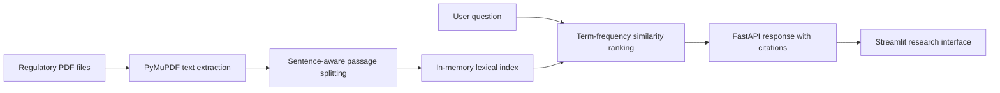

# Niyam: Regulatory Intelligence

**Ask regulatory questions in plain language. Get relevant PDF passages with page-level citations.**

Niyam is a containerized regulatory-document research prototype built with FastAPI and Streamlit. It extracts text from local PDF files, breaks it into readable passages, ranks passages against a question, and presents results with source context.

> **Project status:** Working end-to-end prototype. The current retriever uses lexical term-frequency similarity and keeps its index in memory. It does not yet generate answers with an LLM or use the included pgvector schema for retrieval. See [Current scope and next steps](#current-scope-and-next-steps).

## Product preview

The Streamlit interface provides a guided question flow, search settings, example prompts, a connected-service indicator, cited source cards, and passage-match scores.

Run the app locally with Docker Compose:

```powershell
docker compose up --build
```

Then open **http://localhost:8501**. The FastAPI service and interactive API docs are available at **http://localhost:8000** and **http://localhost:8000/docs**.

## How it works



## Features

- **PDF-first workflow:** load text-based regulatory PDFs from `data/raw/`.
- **Page-aware citations:** results identify the source document and starting page.
- **Passage ranking:** an explainable, lightweight lexical similarity baseline ranks relevant excerpts.
- **Interactive research UI:** choose retrieval settings, try suggested questions, inspect citations and matching passages.
- **API and UI separated:** FastAPI exposes a typed `/ask` contract; Streamlit consumes the API over HTTP.
- **Containerized services:** Docker Compose runs the API, PostgreSQL/pgvector service, and UI.

## Quick start

### Prerequisites

- Docker Desktop with the Docker Compose plugin
- A text-extractable regulatory PDF (scanned/image-only files need OCR before indexing)

### Run

From the project root:

```powershell
docker compose up --build
```

The initial API image build installs the Python dependencies and may take a few minutes.

### Add regulatory documents

1. Put one or more PDF files in `data/raw/`.
2. Restart the API so it reads the new files:

   ```powershell
   docker compose restart api
   ```

3. Open the UI at **http://localhost:8501** and ask a question about the documents.

The raw-document directory is excluded from Git so regulatory source files are not accidentally published with the project.

### Stop

```powershell
docker compose down
```

To also remove the local PostgreSQL volume and its data, run `docker compose down -v`. This is destructive to the database volume; use it only when you intend to reset that local data.

## API

`POST /ask` accepts JSON:

```json
{
  "question": "What disclosures are required for material risk exposures?",
  "strategy": "recursive",
  "mode": "hybrid_rerank",
  "top_k": 5
}
```

Supported values:

| Field | Accepted values |
| --- | --- |
| `question` | 5–500 characters |
| `strategy` | `fixed`, `recursive` |
| `mode` | `vector`, `keyword`, `hybrid`, `hybrid_rerank` |
| `top_k` | Integer from 1 to 10 |

Example PowerShell request:

```powershell
$body = @{
  question = "What disclosures are required for material risk exposures?"
  strategy = "recursive"
  mode = "hybrid_rerank"
  top_k = 5
} | ConvertTo-Json

Invoke-RestMethod `
  -Method Post `
  -Uri "http://localhost:8000/ask" `
  -ContentType "application/json" `
  -Body $body
```

Other useful endpoints:

| Endpoint | Purpose |
| --- | --- |
| `GET /health` | API and in-memory index status |
| `GET /db-status` | Check database connectivity |
| `GET /docs` | Interactive OpenAPI documentation |

## Development checks

With the project dependencies installed, run the lint and unit-test checks with:

```powershell
py -3.11 -m ruff check .
py -3.11 -m ruff format --check .
py -3.11 -m pytest tests/ -q
```

## Configuration

Application settings are defined in [`app/config.py`](app/config.py). Docker Compose currently supplies the database URL and API/model settings directly in the `api` service configuration.

For a deployment beyond local development, replace development defaults, configure authentication and secret injection, restrict network exposure, and review data-retention requirements before loading non-public regulatory or organizational documents.

## Project structure

```text
app/
  config.py          Application settings
  main.py            FastAPI application and endpoints
  retrieval.py       PDF extraction, chunking, and lexical ranking
  schemas.py         API request/response models
  db.py              Async PostgreSQL connection-pool helper
data/
  raw/               Local PDF inputs (git-ignored)
  sources.json       Source manifest placeholder
scripts/
  init_db.sql        PostgreSQL/pgvector schema and indexes
ui/
  Dockerfile         Streamlit image definition
  requirements.txt   UI dependencies
  streamlit_app.py   Interactive research interface
docker-compose.yml   Local multi-service setup
```

## Current scope and next steps

This repository is intentionally transparent about the prototype boundary:

- PDF extraction, passage splitting, ranking, citations, the API, and the UI work together.
- The current ranking uses token-frequency cosine similarity; despite the API's configurable `mode` and `strategy` fields, those options do not yet select distinct retrieval algorithms.
- The PostgreSQL/pgvector schema and database service are present, but the current `/ask` path uses an in-memory index rather than persisted vector search.
- The response summarizes matching excerpts; it is not an LLM-generated or independently verified legal interpretation.
- Image-only PDF OCR, a document-download/ingestion CLI, automated evaluation, and production authentication are not implemented yet.

Good next milestones are to connect the pgvector schema to ingestion and retrieval, implement distinct retrieval modes, add optional grounded answer generation with explicit citations, and build a test/evaluation suite.

## Technology

Python · FastAPI · Streamlit · PostgreSQL · pgvector · PyMuPDF · Docker Compose
## 🤝 Connect & Contribute
I’m always open to feedback, collaboration, or chat about analytics engineering, automation, or data storytelling.

📧 Email: nirrmit.rtickoo@gmail.com

🌐 Portfolio: [NRT](https://nirrmitt.github.io/NRT-Terminal)

💼 LinkedIn: [Nirrmit R. Tickoo](https://www.linkedin.com/in/n-r-t/)

🐙 GitHub: [ @nirrmitt](https://github.com/Nirrmitt)

🔧 Found a bug or have an idea? Open an issue or submit a PR. I review all contributions!

### 📜 License
MIT ©[Nirrmitt](https://nirrmitt.github.io/NRT-Terminal) Feel free to use, adapt, and build upon this for your own projects or learning journey.

## Responsible use

Niyam is a research aid, not legal advice or a substitute for consulting the applicable official circular, regulation, or professional counsel. Verify every cited passage in its original source and confirm that the document version is current before relying on it.
