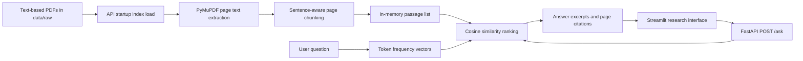

<h1 align="center">Niyam | Regulatory Intelligence</h1>
<p align="center"><strong>A citation-first research prototype for asking plain-language questions over regulatory PDFs.</strong></p>

<p align="center">
  <a href="https://github.com/Nirrmitt/niyam-regulatory-intelligence"></a>
  
  
  
  
</p>

Niyam explores a practical research workflow: extract text from local regulatory PDFs, split it into approximately bounded, page-aware passages, rank the passages against a question, and return excerpts with source citations through a FastAPI service and an interactive Streamlit interface.

> **Prototype scope:** the current search is lexical, in-memory term-frequency cosine similarity. Answers are assembled from retrieved text; there is no LLM answer generation or semantic embedding search in the `/ask` path. PostgreSQL/pgvector is included as an optional service/schema foundation, but is not the active retrieval store. The configurable search modes and strategies currently share the same ranking implementation.

## Contents

- [Highlights](#highlights)
- [Technical architecture](#technical-architecture)
- [Retrieval and answer behavior](#retrieval-and-answer-behavior)
- [User interface](#user-interface)
- [API reference](#api-reference)
- [Data and persistence](#data-and-persistence)
- [Requirements](#requirements)
- [Run with Docker Compose](#run-with-docker-compose)
- [Run locally without Docker](#run-locally-without-docker)
- [Add source documents](#add-source-documents)
- [Development and tests](#development-and-tests)
- [Configuration](#configuration)
- [Repository layout](#repository-layout)
- [Known limitations and roadmap](#known-limitations-and-roadmap)
- [Responsible use](#responsible-use)

## Highlights

- **Question-to-passage workflow:** ask a question in natural language and inspect the strongest matching excerpts.
- **PDF text extraction:** reads selectable text from PDF pages with PyMuPDF.
- **Page-level provenance:** each retrieved passage and citation includes its source filename-derived title and starting page.
- **Explainable baseline retrieval:** token-frequency cosine similarity provides a lightweight lexical ranking baseline.
- **Interactive research desk:** Streamlit includes suggested questions, configurable request fields, citation cards, and passage scores.
- **Typed HTTP boundary:** Pydantic request/response schemas document and validate the FastAPI contract.
- **Containerized services:** Compose defines the API, PostgreSQL with pgvector, and UI services with health checks.
- **Focused automated checks:** unit tests cover ranking, top-k limits, empty-index behavior, and request validation.

## Technical architecture

### Request and indexing flow



1. On startup, the API scans `data/raw/` for `*.pdf` files.
2. PyMuPDF extracts text page by page; pages without selectable text are skipped.
3. Extracted page text is normalized, split around sentence punctuation, and grouped into bounded passages.
4. At request time, the question and each passage are tokenized into term-frequency maps.
5. The API ranks passages by cosine similarity and builds response excerpts and citations from the top matches.
6. Streamlit renders the answer text, citation snippets, and retrieved passages.

The index exists only in the API process memory. Restarting the API rebuilds it from the PDFs still present in `data/raw/`.

### Ranking details

The baseline tokenizer lowercases text and extracts words matching `[a-zA-Z][a-zA-Z0-9-]{2,}`. Term frequency is used directly; there is no stemming, stop-word removal, inverse document frequency, query expansion, or neural embedding in the active path. Cosine similarity ranks passages, and the API returns up to the requested `top_k`. Chunk sizing is heuristic: a single long sentence can exceed the configured target, and overlap is approximated by carrying sentence tails forward rather than by a tokenizer.

The API currently copies the same lexical similarity value into `vector_score`, `keyword_score`, `rerank_score`, and `fused_score` for schema compatibility. These fields do **not** represent independent vector, keyword, reranking, or fusion stages yet. Likewise, `strategy` and `mode` are validated and reported as request metadata but do not change the retrieval algorithm.

### Answer construction

When passages match, the API concatenates excerpts from up to the first three results, limits each contribution and the final summary, and labels the text as likely based on source excerpts. This is excerpt assembly, not model-generated synthesis or legal interpretation. `answered` currently means a passage was returned; it does not certify that the match is relevant or legally sufficient.

## User interface

The Streamlit application is an interactive research desk with:

- Search controls for the request's chunking strategy, retrieval mode, and source count.
- Suggested questions to help start a query.
- API connection and indexed-passage indicators.
- A question form with visible input validation and request errors.
- An answer panel, cited source/page cards, top-match score, and expandable passage details.

The controls currently send the API's validated parameters, but selecting a different mode or strategy does not select a different ranking implementation. The interface is not a document-upload tool: source PDFs are placed in `data/raw/`.

## API reference

FastAPI's interactive OpenAPI documentation is available at `/docs` while the service is running.

| Method | Path | Purpose | Current behavior |
| --- | --- | --- | --- |
| `GET` | `/health` | Report API/index startup state | Returns `status`, a static `db_connected: false`, `models_loaded`, and the number of indexed passages |
| `POST` | `/ask` | Search indexed PDFs | Validates a question, ranks passages, and returns excerpt-based answer text with citations |
| `GET` | `/db-status` | Probe PostgreSQL | Opens a one-off connection and runs `SELECT 1`; this is separate from `/ask` retrieval |
| `GET` | `/docs` | OpenAPI docs | FastAPI-generated interactive API reference |
| `GET` | `/openapi.json` | OpenAPI schema | FastAPI-generated schema |

### `POST /ask`

Request:

```json
{
  "question": "What disclosures are required for material risk exposures?",
  "strategy": "recursive",
  "mode": "hybrid_rerank",
  "top_k": 5
}
```

| Field | Type | Validation | Current effect |
| --- | --- | --- | --- |
| `question` | string | 5–500 characters | Used to build the lexical query vector |
| `strategy` | string | `fixed` or `recursive` | Validated and returned in metadata; does not alter chunking |
| `mode` | string | `vector`, `keyword`, `hybrid`, or `hybrid_rerank` | Validated and returned in metadata; does not alter ranking |
| `top_k` | integer | 1–10 | Number of passages and citations returned |

The response is modeled by `AskResponse`:

| Field | Meaning |
| --- | --- |
| `answer` | Excerpt-based response text, or a no-documents message |
| `answered` | Whether the retriever returned at least one passage |
| `top_score` | Highest lexical cosine similarity |
| `cited_sources` | Document title, starting page, and short excerpt for each returned result |
| `retrieved_sources` | Returned passages and score fields |
| `meta` | Validated request options, question length, loaded passage count, and match count |

Example PowerShell request:

```powershell
$body = @{
  question = "What disclosures are required for material risk exposures?"
  strategy = "recursive"
  mode = "hybrid_rerank"
  top_k = 5
} | ConvertTo-Json

Invoke-RestMethod `
  -Method Post `
  -Uri "http://localhost:8000/ask" `
  -ContentType "application/json" `
  -Body $body
```

Invalid request fields are rejected by FastAPI/Pydantic with HTTP `422`. With no indexed passages, the API returns `answered: false` and empty citation/result arrays.

## Data and persistence

### Source document handling

- Input location: `data/raw/*.pdf`
- Extraction library: PyMuPDF (`fitz`)
- Indexing cadence: once when the API process starts
- Passage metadata: sequential in-process ID, PDF filename-derived title, source filename, page number, text, and score fields
- Persistence of indexed passages: in-memory only; PDFs remain the durable input

Only PDFs with selectable text are supported in the current path. Image-only/scanned PDFs need OCR before use. The `data/raw/` contents are git-ignored so user-provided documents are not published accidentally.

### PostgreSQL and pgvector

Compose also starts `pgvector/pgvector:pg16` and initializes the schema in `scripts/init_db.sql`, including `documents`, `chunks`, `query_log`, a 384-dimensional vector column, and vector/full-text indexes. This schema is groundwork for a future persistent retriever: the current startup loader and `/ask` route do not write to or query these tables. The health response consequently reports `db_connected: false`; use `/db-status` to test the separate database service.

## Requirements

- Docker Desktop with Docker Compose, for the full stack; or
- Python 3.11 and pip, for local API/UI processes
- Text-based PDF files for meaningful search results

The project declares its API/application dependencies in `requirements.txt` and the UI dependencies in `ui/requirements.txt`. The API image also downloads an embedding-model package/cache during its build, but that model is not used by the current lexical retrieval path; first build can therefore take longer and require a network connection.

## Run with Docker Compose

From the repository root, with Docker Desktop running:

```powershell
docker compose up --build
```

Wait for the services to report healthy, then open:

| Service | Local address |
| --- | --- |
| Streamlit research desk | [http://localhost:8501](http://localhost:8501) |
| FastAPI | [http://localhost:8000](http://localhost:8000) |
| Interactive API docs | [http://localhost:8000/docs](http://localhost:8000/docs) |

Useful commands:

```powershell
# List containers and health status
docker compose ps

# Follow API logs
docker compose logs -f api

# Stop containers; preserve database volume
docker compose down
```

`docker compose down -v` additionally deletes the local PostgreSQL volume and its contents; only use it when you intend to remove that local database data.

## Run locally without Docker

The in-memory PDF retrieval route does not require PostgreSQL. `/db-status` does.

Create a virtual environment and install the application and UI dependencies:

```powershell
py -3.11 -m venv .venv
.\.venv\Scripts\Activate.ps1
python -m pip install -r requirements.txt
python -m pip install -r ui/requirements.txt
```

Start the API in one terminal from the repository root:

```powershell
uvicorn app.main:app --host 127.0.0.1 --port 8000
```

Start the UI in a second terminal:

```powershell
$env:API_URL = "http://127.0.0.1:8000"
streamlit run ui/streamlit_app.py --server.address 127.0.0.1 --server.port 8501
```

Open `http://127.0.0.1:8501`. Use `Ctrl+C` in each terminal to stop the local processes.

## Add source documents

1. Obtain regulatory PDFs from their official publisher or another source you are permitted to use.
2. Place text-extractable PDFs in `data/raw/`.
3. If running Compose, restart the API to rebuild its in-memory index:

   ```powershell
   docker compose restart api
   ```

4. Check `GET /health` for `documents_loaded`, then submit a question in the UI.

The app reads `*.pdf` files in the directory; it does not download source URLs from `data/sources.json`, perform OCR, or offer file uploads.

## Development and tests

Install `requirements.txt`, then from the repository root run:

```powershell
py -3.11 -m ruff check .
py -3.11 -m ruff format --check .
py -3.11 -m pytest tests/ -q
```

The focused tests exercise retrieval ordering, top-k behavior, empty-index behavior, and request-schema acceptance/rejection. They do not evaluate legal accuracy, OCR, database-backed retrieval, or LLM generation.

## Configuration

Defaults live in `app/config.py`; Compose also sets service environment values in `docker-compose.yml`. Relevant settings include:

| Setting | Purpose | Prototype behavior |
| --- | --- | --- |
| `DATABASE_URL` | PostgreSQL connection string | Used by `/db-status`; not used by `/ask` |
| `API_KEY` | Optional header comparison setting | Middleware rejects a supplied wrong key, but currently allows a missing key; not production authentication |
| `CHUNK_TOKENS` | Approximate page chunk target | Converts to an approximate character target using four characters per configured token |
| `CHUNK_OVERLAP` | Approximate overlap setting | Used as a rough overlap threshold; not a tokenizer-based token overlap |
| `OPENROUTER_API_KEY` | Future model integration setting | Not consumed by current routes |
| `EMBED_MODEL`, `RERANK_MODEL` | Model identifiers | Not used in current lexical search |
| `TOP_K`, `DEFAULT_MODE`, `DEFAULT_STRATEGY` | Retrieval defaults | Request UI/API values are validated independently; algorithm currently stays the same |

Compose currently supplies some settings as explicit service environment variables. Review `docker-compose.yml` before assuming local `.env` overrides those values.

## Repository layout

```text
app/
  config.py             Settings and development defaults
  db.py                 Async PostgreSQL pool context manager
  main.py               FastAPI endpoints and request orchestration
  retrieval.py          PDF extraction, chunk splitting, lexical ranking
  schemas.py            Pydantic API request and response models
data/
  raw/                  Local PDF inputs (git-ignored)
  sources.json          Source manifest placeholder
scripts/
  init_db.sql           PostgreSQL/pgvector foundation schema
tests/
  test_retrieval.py     Focused search/schema tests
ui/
  Dockerfile            Streamlit container definition
  requirements.txt      UI dependencies
  streamlit_app.py      Interactive research interface
Dockerfile              FastAPI container definition
docker-compose.yml      API, PostgreSQL/pgvector, and UI services
requirements.txt        API and project dependencies
```

## Known limitations and roadmap

### Current limitations

- **Lexical matching only:** term-frequency cosine similarity misses paraphrases and concepts without shared terms.
- **No actual RAG/LLM generation:** response text is assembled from source passages, not generated or verified by a language model.
- **Search options are placeholders:** the `mode` and `strategy` values do not choose distinct implementations.
- **No score cutoff:** any non-empty retrieval result is marked answered, even if the best match is weak.
- **Memory-only index:** passages are re-read and re-indexed at API startup; PostgreSQL is not the active `/ask` store.
- **No OCR or download workflow:** scanned PDFs, automatic source acquisition, and UI uploads are unsupported.
- **Page-level only:** passages retain a starting page; chunk boundaries do not span pages in the current implementation.
- **Development security only:** the optional API-key middleware permits requests that omit the header; Compose uses development credentials and exposes local ports.
- **No legal validation:** relevance scores and citations do not establish regulatory applicability or legal correctness.

### Potential next steps

1. Implement durable PDF/document ingestion and persist passage metadata in PostgreSQL.
2. Add real embedding generation and pgvector similarity search, with separate keyword/hybrid modes.
3. Implement a grounded generation flow that cites source passages and clearly abstains on weak evidence.
4. Add configurable relevance thresholds and evaluation datasets for recall, ranking quality, and citation correctness.
5. Add scanned-PDF OCR, supported file uploads, secure authentication, and deployment-focused configuration.

## Responsible use

Niyam is a software prototype and research aid-not legal advice, a compliance determination, or a replacement for the applicable official circular, regulation, or professional counsel. Verify every excerpt against its original, current source and assess its applicability before relying on it. Respect document licenses, confidentiality requirements, and organizational data-handling policies.

## 🤝 Connect & Contribute
I’m always open to feedback, collaboration, or chat about analytics engineering, automation, or data storytelling.

📧 Email: nirrmit.rtickoo@gmail.com

🌐 Portfolio: [NRT](https://nirrmitt.github.io/NRT-Terminal)

💼 LinkedIn: [Nirrmit R. Tickoo](https://www.linkedin.com/in/n-r-t/)

🐙 GitHub: [ @nirrmitt](https://github.com/Nirrmitt)

🔧 Found a bug or have an idea? Open an issue or submit a PR. I review all contributions!

### 📜 License
MIT ©[Nirrmitt](https://nirrmitt.github.io/NRT-Terminal) Feel free to use, adapt, and build upon this for your own projects or learning journey.

