<h1 align="center">Niyam | Regulatory Intelligence</h1>
<p align="center"><strong>A citation-first research prototype for asking plain-language questions over regulatory PDFs.</strong></p>

<p align="center">
  <a href="https://github.com/Nirrmitt/niyam-regulatory-intelligence"></a>
  
  
  
  
</p>

Niyam extracts text from local regulatory PDFs, splits it into page-aware passages, retrieves evidence for plain-language questions, and generates citation-grounded answers through a FastAPI service and an interactive Streamlit interface.

> **Prototype scope:** the API embeds PDF passages in memory, retrieves relevant text, and can generate answers grounded in those passages through OpenRouter. PostgreSQL/pgvector remains an optional service/schema foundation; the active `/ask` index is rebuilt in API memory at startup.

## Contents

- [Highlights](#highlights)
- [Technical architecture](#technical-architecture)
- [Retrieval and answer behavior](#retrieval-and-answer-behavior)
- [User interface](#user-interface)
- [API reference](#api-reference)
- [Data and persistence](#data-and-persistence)
- [Requirements](#requirements)
- [Run with Docker Compose](#run-with-docker-compose)
- [Run locally without Docker](#run-locally-without-docker)
- [Add source documents](#add-source-documents)
- [Development and tests](#development-and-tests)
- [Configuration](#configuration)
- [Repository layout](#repository-layout)
- [Known limitations and roadmap](#known-limitations-and-roadmap)
- [Responsible use](#responsible-use)

## Highlights

- **Question-to-passage workflow:** ask a question in natural language and inspect the strongest matching excerpts.
- **PDF text extraction:** reads selectable text from PDF pages with PyMuPDF.
- **Page-level provenance:** each retrieved passage and citation includes its source filename-derived title and starting page.
- **Semantic and hybrid retrieval:** sentence-transformer embeddings support meaning-based search alongside keyword and reranked hybrid modes.
- **Grounded answers:** OpenRouter generation is constrained to retrieved excerpts and instructed to cite source labels or abstain when evidence is insufficient.
- **Interactive research desk:** Streamlit includes suggested questions, configurable request fields, citation cards, and passage scores.
- **Typed HTTP boundary:** Pydantic request/response schemas document and validate the FastAPI contract.
- **Containerized services:** Compose defines the API, PostgreSQL with pgvector, and UI services with health checks.
- **Focused automated checks:** unit tests cover retrieval modes, grounded prompts, citations, abstention, top-k limits, and request validation.

## Technical architecture

### Request and indexing flow

```mermaid
flowchart LR
    PDF[Text-based PDFs in data/raw] --> START[API startup index load]
    START --> EXTRACT[PyMuPDF page text extraction]
    EXTRACT --> SPLIT[Sentence-aware page chunking]
    SPLIT --> EMBED[Passage embeddings]
    EMBED --> MEM[In-memory passage and vector index]
    Q[User question] --> QEMBED[Query embedding]
    MEM --> RETRIEVE[Semantic / hybrid retrieval]
    QEMBED --> RETRIEVE
    RETRIEVE --> GENERATE[OpenRouter grounded generation]
    GENERATE --> RESP[Answer and labeled page citations]
    RESP --> UI[Streamlit research interface]
    UI --> API[FastAPI POST /ask]
    API --> RETRIEVE
```



1. On startup, the API scans `data/raw/` for `*.pdf` files.
2. PyMuPDF extracts text page by page; pages without selectable text are skipped.
3. Extracted page text is normalized, split around sentence punctuation, and grouped into bounded passages.
4. At startup, the configured sentence-transformer embeds each passage; vectors are held beside the text in process memory.
5. At request time, the API embeds the question and retrieves passages using the selected semantic, keyword, hybrid, or hybrid-rerank mode.
6. The API sends only the retrieved excerpts to OpenRouter with grounding and citation instructions. The response includes the generated answer, source labels, citations, and retrieval scores.
7. Streamlit renders the answer, source/page citations, and retrieved passages.

The index exists only in the API process memory. Restarting the API rebuilds it from the PDFs still present in `data/raw/`.

### Ranking details

Semantic retrieval uses the configured sentence-transformer model with normalized cosine similarity. The keyword path uses cosine similarity over lowercased term-frequency vectors matching `[a-zA-Z][a-zA-Z0-9-]{2,}`. Hybrid combines both scores; hybrid-rerank applies the configured CrossEncoder to the leading candidates. Chunk sizing is heuristic: a single long sentence can exceed the configured target, and overlap is approximated by carrying sentence tails forward rather than by a tokenizer.

The response exposes separate vector, keyword, reranker, and fused scores. A relevance threshold prevents generation when retrieved evidence is weak. The `strategy` request field remains accepted for API compatibility; passage chunking is currently configured globally rather than selected per request.

`vector_score` is the semantic cosine score, `keyword_score` is lexical cosine similarity, `fused_score` is the weighted hybrid score before reranking, and `rerank_score` is the CrossEncoder score after sigmoid scaling. Hybrid retrieval combines semantic and lexical scores with weights of 0.7 and 0.3. Rerank mode scores up to `CANDIDATE_K` hybrid candidates and returns the top passages.

### Answer construction

When evidence clears the relevance threshold, the API asks the configured OpenRouter model to answer using only the retrieved excerpts. It instructs the model to cite each factual claim with source labels such as `[S1]` and to say when the excerpts do not support an answer. The server returns those labeled source excerpts with document titles and page numbers. A configured `OPENROUTER_API_KEY` is required for generation; missing configuration or provider failures are surfaced as API errors. Citations and generated text still require verification against the original regulation.

## User interface

The Streamlit application is an interactive research desk with:

- Search controls for the request's chunking strategy, retrieval mode, and source count.
- Suggested questions to help start a query.
- API connection and indexed-passage indicators.
- A question form with visible input validation and request errors.
- An answer panel, cited source/page cards, top-match score, and expandable passage details.

The search-mode control selects the retrieval implementation. The chunking-strategy control is retained for compatibility but does not yet select a different chunking pipeline. The interface is not a document-upload tool: source PDFs are placed in `data/raw/`.

## API reference

FastAPI's interactive OpenAPI documentation is available at `/docs` while the service is running.

| Method | Path | Purpose | Current behavior |
| --- | --- | --- | --- |
| `GET` | `/health` | Report API/index startup state | Returns model/generation configuration status and the number of indexed passages |
| `POST` | `/ask` | Search indexed PDFs | Retrieves passages, checks evidence strength, and generates an OpenRouter answer with source citations |
| `GET` | `/db-status` | Probe PostgreSQL | Opens a one-off connection and runs `SELECT 1`; this is separate from `/ask` retrieval |
| `GET` | `/docs` | OpenAPI docs | FastAPI-generated interactive API reference |
| `GET` | `/openapi.json` | OpenAPI schema | FastAPI-generated schema |

### `POST /ask`

Request:

```json
{
  "question": "What disclosures are required for material risk exposures?",
  "strategy": "recursive",
  "mode": "hybrid_rerank",
  "top_k": 5
}
```

| Field | Type | Validation | Current effect |
| --- | --- | --- | --- |
| `question` | string | 5–500 characters | Embedded for semantic retrieval and supplied to grounded answer generation |
| `strategy` | string | `fixed` or `recursive` | Validated and returned in metadata; does not alter chunking |
| `mode` | string | `vector`, `keyword`, `hybrid`, or `hybrid_rerank` | Selects semantic, keyword, hybrid, or reranked hybrid retrieval |
| `top_k` | integer | 1–10 | Maximum retrieved passages supplied for generation and returned in the response |

The response is modeled by `AskResponse`:

| Field | Meaning |
| --- | --- |
| `answer` | Grounded model-generated response, or a no-evidence message |
| `answered` | Whether evidence cleared the configured relevance threshold and generation succeeded |
| `top_score` | Best score for the selected retrieval mode |
| `cited_sources` | Source label (`S1`, `S2`, ...), document title, starting page, and short excerpt for each retrieved result; answer citations use these labels |
| `retrieved_sources` | Returned passages and score fields |
| `meta` | Validated request options, question length, loaded passage count, and match count |

Example PowerShell request:

```powershell
$body = @{
  question = "What disclosures are required for material risk exposures?"
  strategy = "recursive"
  mode = "hybrid_rerank"
  top_k = 5
} | ConvertTo-Json

Invoke-RestMethod `
  -Method Post `
  -Uri "http://localhost:8000/ask" `
  -ContentType "application/json" `
  -Body $body
```

Invalid request fields are rejected by FastAPI/Pydantic with HTTP `422`. With no indexed passages, the API returns `answered: false` and empty citation/result arrays. Weak matches return `answered: false` without calling the language model. Missing OpenRouter configuration returns HTTP `503`; provider failures return HTTP `502`.

## Data and persistence

### Source document handling

- Input location: `data/raw/*.pdf`
- Extraction library: PyMuPDF (`fitz`)
- Indexing cadence: once when the API process starts
- Passage metadata: sequential in-process ID, PDF filename-derived title, source filename, page number, text, and score fields
- Persistence of indexed passages: in-memory only; PDFs remain the durable input

Only PDFs with selectable text are supported in the current path. Image-only/scanned PDFs need OCR before use. The `data/raw/` contents are git-ignored so user-provided documents are not published accidentally.

### PostgreSQL and pgvector

Compose also starts `pgvector/pgvector:pg16` and initializes the schema in `scripts/init_db.sql`, including `documents`, `chunks`, `query_log`, a 384-dimensional vector column, and vector/full-text indexes. The active retriever currently keeps embeddings and passages in API memory; it does not persist to these tables. The health response reports `db_connected: false`; use `/db-status` to test the separate database service.

## Requirements

- Docker Desktop with Docker Compose, for the full stack; or
- Python 3.11 and pip, for local API/UI processes
- Text-based PDF files for meaningful search results

The project declares its API/application dependencies in `requirements.txt` and the UI dependencies in `ui/requirements.txt`. The API downloads the embedding model during image build; model weights and the reranker may require a network connection on first use. Answer generation requires an OpenRouter API key.

## Run with Docker Compose

From the repository root, with Docker Desktop running:

```powershell
Copy-Item .env.example .env
# Edit .env and set OPENROUTER_API_KEY for generated answers
docker compose up --build
```

Wait for the services to report healthy, then open:

| Service | Local address |
| --- | --- |
| Streamlit research desk | [http://localhost:8501](http://localhost:8501) |
| FastAPI | [http://localhost:8000](http://localhost:8000) |
| Interactive API docs | [http://localhost:8000/docs](http://localhost:8000/docs) |

Useful commands:

```powershell
# List containers and health status
docker compose ps

# Follow API logs
docker compose logs -f api

# Stop containers; preserve database volume
docker compose down
```

`docker compose down -v` additionally deletes the local PostgreSQL volume and its contents; only use it when you intend to remove that local database data.

## Run locally without Docker

PDF retrieval and answer generation require model downloads and do not require PostgreSQL. `/db-status` does.

Create a virtual environment and install the application and UI dependencies:

```powershell
py -3.11 -m venv .venv
.\.venv\Scripts\Activate.ps1
python -m pip install -r requirements.txt
python -m pip install -r ui/requirements.txt
if (-not (Test-Path .env)) { Copy-Item .env.example .env }
# Edit .env and set OPENROUTER_API_KEY
```

Start the API in one terminal from the repository root:

```powershell
uvicorn app.main:app --host 127.0.0.1 --port 8000
```

Start the UI in a second terminal:

```powershell
$env:API_URL = "http://127.0.0.1:8000"
streamlit run ui/streamlit_app.py --server.address 127.0.0.1 --server.port 8501
```

Open `http://127.0.0.1:8501`. Use `Ctrl+C` in each terminal to stop the local processes.

## Add source documents

1. Obtain regulatory PDFs from their official publisher or another source you are permitted to use.
2. Place text-extractable PDFs in `data/raw/`.
3. If running Compose, restart the API to rebuild its in-memory index:

   ```powershell
   docker compose restart api
   ```

4. Check `GET /health` for `documents_loaded`, then submit a question in the UI.

The app reads `*.pdf` files in the directory; it does not download source URLs from `data/sources.json`, perform OCR, or offer file uploads.

## Development and tests

Install `requirements.txt`, then from the repository root run:

```powershell
py -3.11 -m ruff check .
py -3.11 -m ruff format --check .
py -3.11 -m pytest tests/ -q
```

The focused tests exercise retrieval modes, reranking, generation requests and grounding instructions, answer citations, weak-evidence abstention, top-k behavior, empty-index behavior, and request-schema acceptance/rejection. They do not evaluate legal accuracy, OCR, database-backed retrieval, or model output quality.

## Configuration

Defaults live in `app/config.py`; Compose also sets service environment values in `docker-compose.yml`. Relevant settings include:

| Setting | Purpose | Prototype behavior |
| --- | --- | --- |
| `DATABASE_URL` | PostgreSQL connection string | Used by `/db-status`; not used by `/ask` |
| `API_KEY` | Optional header comparison setting | Middleware rejects a supplied wrong key, but currently allows a missing key; not production authentication |
| `CHUNK_TOKENS` | Approximate page chunk target | Converts to an approximate character target using four characters per configured token |
| `CHUNK_OVERLAP` | Approximate overlap setting | Used as a rough overlap threshold; not a tokenizer-based token overlap |
| `OPENROUTER_API_KEY` | OpenRouter credential | Required for answer generation; absent key produces HTTP `503` when evidence is sufficient |
| `OPENROUTER_MODEL` | OpenRouter chat model | Model used to generate grounded answers |
| `EMBED_MODEL`, `RERANK_MODEL` | Model identifiers | Used for semantic passage retrieval and hybrid reranking |
| `TOP_K`, `DEFAULT_MODE`, `DEFAULT_STRATEGY` | Retrieval defaults | Controls default retrieval settings; `strategy` is currently compatibility-only |
| `CANDIDATE_K` | Hybrid reranker candidate count | Limits the passages reranked before selecting `top_k` |
| `SIMILARITY_THRESHOLD`, `RERANK_THRESHOLD` | Evidence thresholds | Weak matches abstain instead of being sent for answer generation |

Compose forwards `OPENROUTER_API_KEY` and `OPENROUTER_MODEL` from `.env`; other Compose settings are set in `docker-compose.yml`.

## Repository layout

```text
app/
  config.py             Settings and development defaults
  db.py                 Async PostgreSQL pool context manager
  generation.py         OpenRouter grounded-answer generation
  main.py               FastAPI endpoints and request orchestration
  retrieval.py          PDF extraction, chunk splitting, embedding and retrieval
  schemas.py            Pydantic API request and response models
data/
  raw/                  Local PDF inputs (git-ignored)
  sources.json          Source manifest placeholder
scripts/
  init_db.sql           PostgreSQL/pgvector foundation schema
tests/
  test_generation.py    Grounded-generation prompt tests
  test_main.py          Answer, citation, and abstention tests
  test_retrieval.py     Retrieval and request-schema tests
ui/
  Dockerfile            Streamlit container definition
  requirements.txt      UI dependencies
  streamlit_app.py      Interactive research interface
Dockerfile              FastAPI container definition
docker-compose.yml      API, PostgreSQL/pgvector, and UI services
requirements.txt        API and project dependencies
```

## Known limitations and roadmap

### Current limitations

- **In-memory index:** passages are re-read and re-embedded at API startup; PostgreSQL is not the active `/ask` store.
- **External generation dependency:** grounded answer generation requires an OpenRouter API key and provider availability.
- **Chunking strategy is global:** the request's `strategy` value does not yet select a distinct chunking implementation.
- **No automated citation validation:** the model is instructed to cite retrieved source labels, but its generated claims and citations still need review.
- **No OCR or download workflow:** scanned PDFs, automatic source acquisition, and UI uploads are unsupported.
- **Page-level only:** passages retain a starting page; chunk boundaries do not span pages in the current implementation.
- **Development security only:** the optional API-key middleware permits requests that omit the header; Compose uses development credentials and exposes local ports.
- **No legal validation:** relevance scores and citations do not establish regulatory applicability or legal correctness.

### Potential next steps

1. Persist embeddings and passage metadata in PostgreSQL/pgvector.
2. Add evaluation datasets for recall, ranking quality, and citation correctness.
3. Add scanned-PDF OCR, supported file uploads, secure authentication, and deployment-focused configuration.

## Responsible use

Niyam is a software prototype and research aid-not legal advice, a compliance determination, or a replacement for the applicable official circular, regulation, or professional counsel. Verify every excerpt against its original, current source and assess its applicability before relying on it. Respect document licenses, confidentiality requirements, and organizational data-handling policies.

## 🤝 Connect & Contribute
I’m always open to feedback, collaboration, or chat about analytics engineering, automation, or data storytelling.

📧 Email: nirrmit.rtickoo@gmail.com

🌐 Portfolio: [NRT](https://nirrmitt.github.io/NRT-Terminal)

💼 LinkedIn: [Nirrmit R. Tickoo](https://www.linkedin.com/in/n-r-t/)

🐙 GitHub: [ @nirrmitt](https://github.com/Nirrmitt)

🔧 Found a bug or have an idea? Open an issue or submit a PR. I review all contributions!

### 📜 License
MIT ©[Nirrmitt](https://nirrmitt.github.io/NRT-Terminal) Feel free to use, adapt, and build upon this for your own projects or learning journey.

